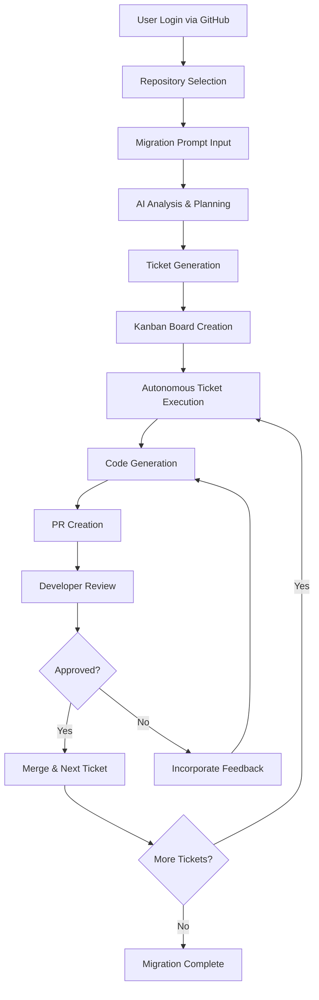

# Shadow 

**The Next-Generation AI Migration Platform**

Shadow is an intelligent AI employee that automates complex migration processes, transforming how development teams handle technology stack transitions. From WordPress to Next.js, legacy systems to modern frameworks - Shadow handles the entire migration lifecycle with precision and efficiency.

## Overview

Shadow revolutionizes software migration by combining AI-powered code generation with intelligent project management. It acts as your dedicated AI employee, working autonomously to plan, execute, and manage complex migration projects while keeping your development team in the loop through seamless collaboration workflows.

### Key Features

- ** Seamless OAuth Integration** - Connect via GitHub OAuth for instant repository access
- ** AI-Powered Migration Planning** - Intelligent analysis and ticket generation
- ** Trello-Style Project Management** - Visual kanban boards with automated ticket progression  
- ** Groq-Powered Inference** - Lightning-fast AI code generation and analysis
- ** Developer Collaboration** - Built-in PR review workflows and team notifications
- ** End-to-End Automation** - From planning to deployment, Shadow handles it all

## How It Works

### 1. **Connect & Sync**
- Login with GitHub OAuth
- Select repositories to work with
- Shadow syncs and analyzes your codebase

### 2. **Define Your Migration**
Send a simple prompt like:
```
"I want to migrate from WordPress to Next.js with a modern React frontend and API backend"
```

### 3. **AI Planning & Ticket Generation**
Shadow automatically:
- Analyzes your current codebase
- Creates a comprehensive migration strategy
- Generates detailed tickets in a Trello-style board
- Prioritizes tasks based on dependencies

### 4. **Autonomous Execution**
- Shadow selects and completes tickets systematically
- Generates production-ready code for each task
- Creates pull requests for developer review
- Waits for approval before proceeding to next ticket

### 5. **Collaborative Review Process**
- Developers receive notifications for each completed ticket
- Review and approve changes through familiar PR workflows
- Shadow incorporates feedback and continues execution
- Process continues until migration is complete

## Technology Stack

- **Frontend**: Next.js 14, React 18, TypeScript
- **UI Components**: Radix UI, Tailwind CSS
- **AI Inference**: Groq API for fast LLM processing
- **Authentication**: GitHub OAuth
- **Project Management**: Custom Kanban implementation
- **Deployment**: Vercel-ready configuration

## Project Structure

```
shadow-app/
├── app/                    # Next.js app directory
│   ├── account/           # User account management
│   ├── login/             # Authentication pages
│   ├── plan/              # Migration planning interface
│   └── processes/         # Active migration processes
├── components/            # Reusable UI components
│   ├── ui/               # Base UI components (Radix)
│   ├── chat-panel.tsx    # AI interaction interface
│   ├── kanban-board.tsx  # Project management board
│   └── plan-card.tsx     # Migration plan visualization
├── hooks/                # Custom React hooks
├── lib/                  # Utilities and configurations
│   ├── auth.ts          # Authentication logic
│   ├── types.ts         # TypeScript definitions
│   └── mock-data.ts     # Development data
└── styles/              # Global styles
```

## Getting Started

### Prerequisites

- Node.js 18+ 
- pnpm (recommended) or npm
- GitHub account for OAuth
- Groq API key

### Installation

1. **Clone the repository**
   ```bash
   git clone https://github.com/your-org/shadow.git
   cd shadow
   ```

2. **Install dependencies**
   ```bash
   pnpm install
   ```

3. **Environment Setup**
   Create a `.env.local` file:
   ```env
   # GitHub OAuth
   GITHUB_CLIENT_ID=your_github_client_id
   GITHUB_CLIENT_SECRET=your_github_client_secret
   NEXTAUTH_URL=http://localhost:3000
   NEXTAUTH_SECRET=your_nextauth_secret

   # Groq AI
   GROQ_API_KEY=your_groq_api_key

   # Database (if applicable)
   DATABASE_URL=your_database_url
   ```

4. **Run the development server**
   ```bash
   pnpm dev
   ```

5. **Open your browser**
   Navigate to [http://localhost:3000](http://localhost:3000)

## Configuration

### Groq Integration

Shadow leverages Groq's high-performance inference for:
- Code analysis and understanding
- Migration strategy generation
- Automated code writing
- PR description generation

Configure Groq settings in `lib/groq-config.ts`:
```typescript
export const groqConfig = {
  apiKey: process.env.GROQ_API_KEY,
  model: "llama-3.1-70b-versatile", // or your preferred model
  maxTokens: 4096,
  temperature: 0.1 // Lower for more deterministic code generation
}
```

### GitHub OAuth Setup

1. Create a GitHub OAuth App in your GitHub settings
2. Set Authorization callback URL to: `http://localhost:3000/api/auth/callback/github`
3. Add your Client ID and Secret to environment variables

## Migration Process Flow



## UI Components

Shadow uses a modern, accessible design system built on:

- **Radix UI**: Unstyled, accessible components
- **Tailwind CSS**: Utility-first styling
- **Lucide React**: Beautiful, customizable icons
- **Next Themes**: Dark/light mode support

Key components:
- `KanbanBoard`: Interactive project management
- `ChatPanel`: AI interaction interface
- `PlanCard`: Migration plan visualization
- `ProcessTracker`: Real-time progress monitoring

## Security & Best Practices

- **OAuth Security**: Secure GitHub integration with proper scopes
- **API Key Management**: Environment-based configuration
- **Code Review**: Mandatory PR reviews before merging
- **Access Control**: Repository-level permissions
- **Audit Trail**: Complete migration history tracking

### Manual Deployment

```bash
# Build the application
pnpm build

# Start production server
pnpm start
```

### Development Workflow

1. Fork the repository
2. Create a feature branch
3. Make your changes
4. Add tests if applicable
5. Submit a pull request

## Roadmap

- [ ] **Multi-language Support** - Python, Java, PHP migrations
- [ ] **Custom Migration Templates** - Reusable migration patterns
- [ ] **Team Collaboration** - Multi-developer project support
- [ ] **Advanced Analytics** - Migration insights and reporting
- [ ] **Plugin System** - Extensible migration capabilities
- [ ] **Enterprise Features** - SSO, advanced security, compliance

---

**Built with ❤️ by the Shadow Team**

*Transform your migrations from months to days with AI-powered automation.*
